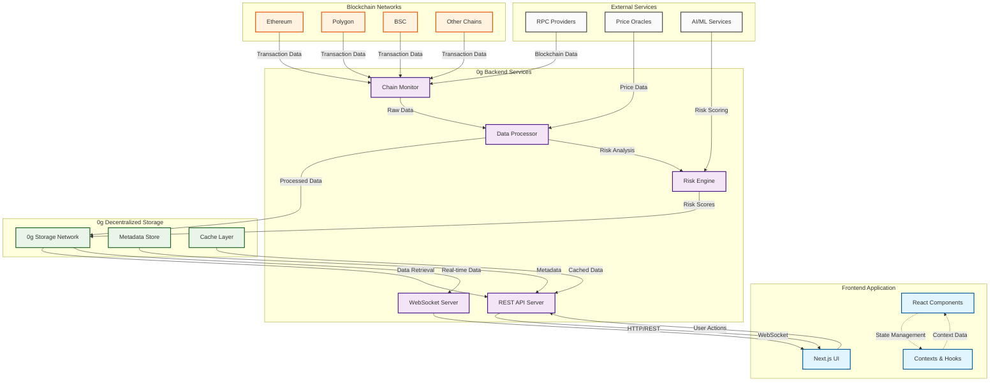

# 0g-Sygna - AI-Powered Blockchain Intelligence

> Real-time blockchain monitoring meets AI-powered risk detection on the 0G Network

0g-Sygna is your intelligent companion for navigating the blockchain. We've built a platform that watches the chain 24/7, analyzing transactions in real-time and alerting you to potential risks before they become problems. Think of it as having a security analyst working around the clock, powered by 0G's decentralized AI infrastructure.

**🔗 Live Demo:** https://chainsage-app.vercel.app

**📺 5-Minute Demo Video:** [Coming Soon]

**🐦 Twitter Thread:** [Link to @0G_Builders tagged thread]

## What Makes 0g-Sygna Different?

### 🎯 Our Unique Approach
Most blockchain explorers just show you data. We analyze it. Using 0G Compute Network's decentralized AI, we process every transaction through advanced risk models to give you actionable insights, not just numbers.

### ✨ Key Features

**🔍 Smart Monitoring**
- Watch any wallet address in real-time
- Get instant alerts when something unusual happens
- Track transaction patterns and volumes

**🤖 AI-Powered Risk Analysis**
- Automatic risk scoring using 0G Compute Network
- Pattern detection for suspicious activity
- Natural language explanations of what's happening

**📊 Beautiful Dashboard**
- Clean, intuitive interface (no blockchain expertise needed)
- Real-time activity feed with AI insights
- Customizable watchlists for addresses you care about

**🔐 Built on 0G Infrastructure**
- Decentralized AI via 0G Compute Network
- Secure, wallet-based authentication
- No API keys or rate limits to worry about

## Tech Stack

### Frontend

- **Framework**: Next.js 15 with React 19
- **Styling**: Tailwind CSS 4.1 with custom animations
- **UI Components**: Radix UI primitives with custom theming
- **Charts**: Recharts for data visualization
- **Forms**: React Hook Form with Zod validation
- **Icons**: Lucide React
- **Deployment**: Vercel

### Backend & Storage

- **Data Storage**: 0g decentralized storage network
- **Backend API**: See [backend](https://github.com/Teamerz1111/backend)
- **Architecture**: Decentralized data management with secure blockchain integration

## 🚀 Live Deployment

### Production URLs
- **Frontend:** https://chainsage-app.vercel.app
- **Backend API:** https://backend-3o2x.onrender.com
- **Network:** 0G Mainnet (Chain ID: 16661)

### 📜 Smart Contract (0G Mainnet)
- **Contract Address:** `0x65259ad0C0872E9EC83b8fcd0a8541BC7015C0978`
- **Block Explorer:** [View on ChainScan](https://chainscan.0g.ai/address/0x65259ad0C0872E9EC83b8fcd0a8541BC7015C0978)
- **Deployment Block:** 11,555,978
- **Deployment Date:** November 4, 2025

**Contract Features:**
- ✅ Watchlist management (add/remove wallets)
- ✅ Risk score tracking (0-100 scale)
- ✅ On-chain data storage
- ✅ Event-driven updates for real-time monitoring

### Quick Start (For Users)
1. Visit https://chainsage-app.vercel.app
2. Connect your MetaMask wallet
3. Start monitoring wallets immediately - no setup needed!

## 🛠️ Local Development Setup

Want to run it locally or contribute? Here's how:

### What You'll Need
- Node.js 18 or higher
- A MetaMask wallet with some 0G tokens for AI features
- Git (obviously)

### Getting Started

```bash
# Clone the repo
git clone https://github.com/Teamerz1111/chainsage-app-v0.git
cd chainsage-app-v0

# Install dependencies
npm install

# Start the dev server
npm run dev

# Open http://localhost:3000
```

That's it! The app will connect to our production backend automatically. If you want to run your own backend, check out the [backend repo](https://github.com/Teamerz1111/backend).

### Available Scripts

- `npm run dev` - Start development server
- `npm run build` - Build for production
- `npm run start` - Start production server
- `npm run lint` - Run ESLint

## Project Structure

```
0g-Sygna-app-v0/
├── app/                    # Next.js app directory
│   ├── admin/             # Admin dashboard pages
│   ├── globals.css        # Global styles
│   ├── layout.tsx         # Root layout
│   ├── loading.tsx        # Loading component
│   └── page.tsx           # Home page
├── components/            # React components
│   ├── ui/               # Reusable UI components
│   ├── activity-feed.tsx # Activity monitoring
│   ├── admin-dashboard.tsx # Admin interface
│   ├── hero-section.tsx  # Landing page hero
│   ├── navbar.tsx        # Navigation
│   ├── risk-feed.tsx     # Risk alerts
│   └── ...               # Other components
├── contexts/             # React contexts
│   └── wallet-context.tsx # Wallet state management
├── hooks/                # Custom React hooks
├── lib/                  # Utilities and configurations
├── public/               # Static assets
├── styles/               # Additional CSS files
└── types/                # TypeScript type definitions
```

## Key Components

### Dashboard Features

- **Activity Feed** (`components/activity-feed.tsx`) - Real-time transaction monitoring
- **Risk Feed** (`components/risk-feed.tsx`) - Risk alerts and scoring
- **Admin Dashboard** (`components/admin-dashboard.tsx`) - Management interface
- **Watchlist Management** - Track specific addresses and contracts

### UI Components

Built with Radix UI primitives and custom styling:

- Forms, dialogs, dropdowns, and navigation
- Custom theming with dark/light mode support
- Matrix-style animations and cyberpunk aesthetic

## ⚙️ Configuration

### Environment Variables (Optional)

The app works out of the box with our production backend, but you can customize it:

```env
# Only needed if running your own backend
NEXT_PUBLIC_API_URL=https://your-backend.com
NEXT_PUBLIC_WS_URL=wss://your-backend.com
```

### 0G Compute Setup

No configuration needed! Just connect your wallet and the app handles everything:
- Wallet-based authentication (no API keys)
- Automatic 0G Compute initialization
- Pay-as-you-go AI analysis

You'll need about 0.1 0G tokens in your wallet for AI features.

## 🧠 How We Use 0G Network

### 0G Compute Network Integration

This is where the magic happens. Instead of using centralized AI APIs (which are expensive and have rate limits), we tap into 0G's decentralized compute network:

**What this means for you:**
- No rate limits - analyze as many transactions as you want
- Better AI models (Llama 3.3 70B, DeepSeek R1)
- Transparent pricing - you only pay for what you use
- Your wallet is your authentication - no API keys to manage

**How it works:**
1. Connect your MetaMask wallet
2. The app automatically initializes 0G Compute
3. When you analyze a transaction, it's processed by decentralized AI nodes
4. Results come back in seconds with detailed risk analysis

### Why 0G Mainnet?

We chose to build on 0G because:
- **Decentralized AI** - No single point of failure
- **Cost-effective** - Way cheaper than traditional AI APIs
- **Scalable** - Can handle high transaction volumes
- **Secure** - Wallet-based auth means no API keys to leak

### Testing the AI Features

Want to see the AI in action? Visit `/test-0g` in the app to:
- Check your 0G Compute connection
- Test AI chat functionality
- Run sample risk analyses
- Monitor your 0G token balance

## 📦 Deployment Details

### Current Production Setup

**Frontend (Vercel)**
- Auto-deploys from main branch
- Global CDN for fast loading
- Serverless functions for API routes

**Backend (Render)**
- Node.js API server
- WebSocket support for real-time updates
- Connected to 0G Mainnet

**0G Network Integration**
- 0G Compute Network (for AI analysis)
- 0G Mainnet RPC: https://evmrpc.0g.ai
- Chain ID: 16661

### Deploy Your Own

Want to fork and deploy your own version?

```bash
# Build for production
npm run build

# Deploy to Vercel
vercel --prod

# Or deploy to any Node.js host
npm start
```

## Architecture

This application follows a decentralized architecture:

- **Frontend**: Next.js application providing the user interface
- **Backend**: 0g-based service handling blockchain data processing and storage
- **Storage**: 0g decentralized storage network for secure, scalable data management
- **Communication**: RESTful APIs and WebSocket connections for real-time updates

### System Architecture Diagram



## 🧪 Testing & Usage

### Try It Out

1. **Visit the live app:** https://chainsage-app.vercel.app
2. **Connect your wallet** (MetaMask recommended)
3. **Search for any Ethereum address** to see its activity
4. **Add addresses to your watchlist** for continuous monitoring
5. **Check the admin dashboard** to manage your watchlists

### Sample Addresses for Testing

Want to see the AI in action? Try monitoring these high-activity wallets:
- Binance Hot Wallet: `0x28C6c06298d514Db089934071355E5743bf21d60`
- Coinbase: `0x71660c4005BA85c37ccec55d0C4493E66Fe775d3`

These addresses have lots of transactions, so you'll see the risk analysis working in real-time.

### What to Look For

- **Activity Feed:** Real-time transaction updates
- **Risk Scores:** AI-generated risk levels (low/medium/high/critical)
- **Anomaly Detection:** Unusual patterns highlighted automatically
- **Real-time Alerts:** WebSocket notifications for watchlist activity

## 🗺️ Roadmap

### What's Next for 0g-Sygna

We're just getting started. Here's what we're planning:

**Short-term (Next 2-3 months)**
- [ ] Multi-chain support (Polygon, BSC, Arbitrum)
- [ ] Advanced risk models with historical pattern analysis
- [ ] Email/Telegram notifications for watchlist alerts
- [ ] Portfolio tracking and analytics

**Medium-term (3-6 months)**
- [ ] 0G Storage integration for historical data
- [ ] Smart contract risk analysis
- [ ] DeFi protocol monitoring
- [ ] Mobile app (React Native)

**Long-term (6+ months)**
- [ ] Community-driven risk models
- [ ] API for developers
- [ ] Browser extension
- [ ] Integration with popular wallets

## 🤝 Contributing

We'd love your help making 0g-Sygna better! Here's how:

1. Fork the repo
2. Create a feature branch (`git checkout -b cool-new-feature`)
3. Make your changes
4. Test thoroughly
5. Submit a pull request

Found a bug? Open an issue and we'll jump on it.

## 📄 License

MIT License - feel free to use this project however you'd like!

## 🙏 Acknowledgments

- Built for the 0G WaveHack 5th Wave
- Powered by 0G Compute Network
- Thanks to the 0G team for their support
- Shoutout to the blockchain dev community

---

**Built with ❤️ on the 0G Network**

Questions? Reach out on Twitter [@0G_Builders](https://twitter.com/0G_Builders)
