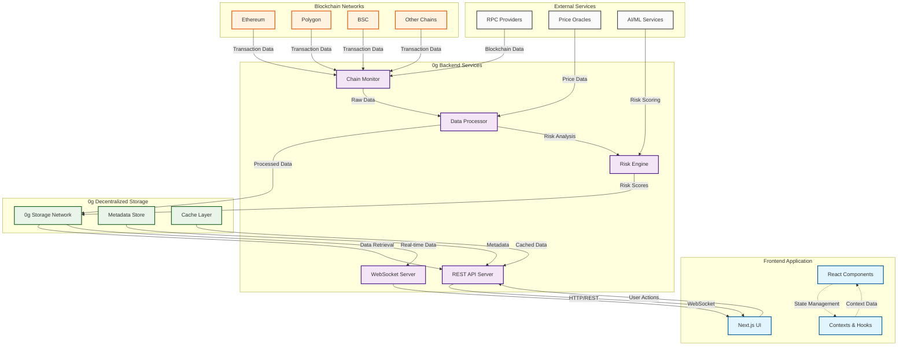

# 0g-Sygna App

0g-Sygna is a real-time blockchain monitoring and risk detection application that provides comprehensive on-chain intelligence. Built on top of the 0g decentralized storage network for secure and scalable data management, it monitors blockchain activity with advanced risk detection, real-time transaction feeds, and watchlist management across multiple chains.

## Features

- **Real-Time Monitoring** - Live blockchain transaction tracking and analysis
- **Risk Detection** - AI-powered risk scoring and pattern detection
- **Activity Feed** - Real-time transaction and activity monitoring
- **Watchlist Management** - Track specific wallet addresses and contracts
- **Multi-Chain Support** - Support for Ethereum, Polygon, BSC, and other networks
- **Admin Dashboard** - Comprehensive management interface
- **Risk Feed** - Categorized risk alerts and notifications

## Tech Stack

### Frontend
- **Framework**: Next.js 15 with React 19
- **Styling**: Tailwind CSS 4.1 with custom animations
- **UI Components**: Radix UI primitives with custom theming
- **Charts**: Recharts for data visualization
- **Forms**: React Hook Form with Zod validation
- **Icons**: Lucide React
- **Deployment**: Vercel

### Backend & Storage
- **Data Storage**: 0g decentralized storage network
- **Backend API**: Located in `../backend` directory
- **Architecture**: Decentralized data management with secure blockchain integration

## Setup

### Prerequisites

- Node.js 18+ or Bun
- Git
- 0g backend service (see `../backend` for setup instructions)

### Installation

1. Clone the repository:
```bash
git clone git@github.com:Teamerz1111/chainsage-app-v0.git
cd chainsage-app-v0
```

2. Install dependencies:
```bash
npm install
# or
bun install
```

3. Set up the backend service:
```bash
# Navigate to the backend directory and follow setup instructions
cd ../backend
# Follow the README instructions in the backend directory
```

4. Set up environment variables:
```bash
cp .env.local.example .env.local
# Configure API endpoints to connect to your 0g backend service
```

5. Start the development server:
```bash
npm run dev
# or
bun dev
```

6. Open [http://localhost:3000](http://localhost:3000) in your browser.

### Available Scripts

- `npm run dev` - Start development server
- `npm run build` - Build for production
- `npm run start` - Start production server
- `npm run lint` - Run ESLint

## Project Structure

```
0g-Sygna-app-v0/
├── app/                    # Next.js app directory
│   ├── admin/             # Admin dashboard pages
│   ├── globals.css        # Global styles
│   ├── layout.tsx         # Root layout
│   ├── loading.tsx        # Loading component
│   └── page.tsx           # Home page
├── components/            # React components
│   ├── ui/               # Reusable UI components
│   ├── activity-feed.tsx # Activity monitoring
│   ├── admin-dashboard.tsx # Admin interface
│   ├── hero-section.tsx  # Landing page hero
│   ├── navbar.tsx        # Navigation
│   ├── risk-feed.tsx     # Risk alerts
│   └── ...               # Other components
├── contexts/             # React contexts
│   └── wallet-context.tsx # Wallet state management
├── hooks/                # Custom React hooks
├── lib/                  # Utilities and configurations
├── public/               # Static assets
├── styles/               # Additional CSS files
└── types/                # TypeScript type definitions
```

## Key Components

### Dashboard Features
- **Activity Feed** (`components/activity-feed.tsx`) - Real-time transaction monitoring
- **Risk Feed** (`components/risk-feed.tsx`) - Risk alerts and scoring
- **Admin Dashboard** (`components/admin-dashboard.tsx`) - Management interface
- **Watchlist Management** - Track specific addresses and contracts

### UI Components
Built with Radix UI primitives and custom styling:
- Forms, dialogs, dropdowns, and navigation
- Custom theming with dark/light mode support
- Matrix-style animations and cyberpunk aesthetic

## Environment Variables

Create a `.env.local` file with the following variables:

```env
# Backend API Configuration
NEXT_PUBLIC_API_URL=http://localhost:8000  # 0g backend service URL
NEXT_PUBLIC_WS_URL=ws://localhost:8080     # WebSocket endpoint for real-time updates

# Add other required environment variables
```

## Deployment

### Vercel (Recommended)

1. Connect your repository to Vercel
2. Configure environment variables in the Vercel dashboard
3. Deploy automatically on git push

Or use the Vercel CLI:

```bash
vercel project
vercel link --yes --project 0g-Sygna-app
vercel --prod
```

### Other Platforms

Build the application:

```bash
npm run build
npm run start
```

## Architecture

This application follows a decentralized architecture:

- **Frontend**: Next.js application providing the user interface
- **Backend**: 0g-based service handling blockchain data processing and storage (see `../backend`)
- **Storage**: 0g decentralized storage network for secure, scalable data management
- **Communication**: RESTful APIs and WebSocket connections for real-time updates

### System Architecture Diagram



## Testing

The project includes sample wallet addresses for testing in `SAMPLE.md`. These are publicly documented exchange hot wallets that exhibit high-volume transaction patterns suitable for testing the monitoring system.

### Backend Integration

Ensure the 0g backend service is running before testing:
1. Follow setup instructions in `../backend/README.md`
2. Verify the backend is accessible at the configured API endpoints
3. Test real-time features require WebSocket connectivity

## License

This project is licensed under the terms specified in the LICENSE file.

## Contributing

1. Fork the repository
2. Create a feature branch (`git checkout -b feature/amazing-feature`)
3. Commit your changes (`git commit -m 'Add amazing feature'`)
4. Push to the branch (`git push origin feature/amazing-feature`)
5. Open a Pull Request